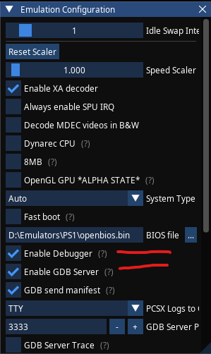

# Playstation 1 Game

## Setup Dev Environment

1. Install PSX.Dev.
2. ctr + shift + p
	1. Search for PSX.Dev, select Show Panel
	2. Select Templates
	3. Select Psy-Q SDK
	4. Install Recommended Tools

3. Install Native Debug [Extension](https://marketplace.visualstudio.com/items?itemName=webfreak.debug)
3. Install clangd [Extension](https://marketplace.visualstudio.com/items?itemName=llvm-vs-code-extensions.vscode-clangd)
4. Reboot...

### Configure PCSX-Redux

We need to configure the emulator to run as a server that we can attach the debugger to.

Select Configuration -> Emulation

Bio File use openbios.bin
Enable Debugger
Enable GDB Server

