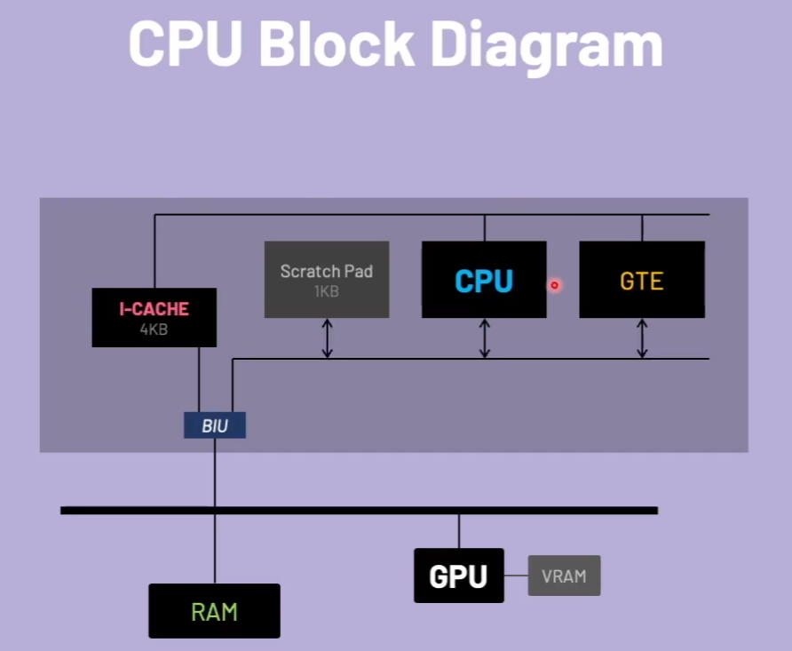

# 3d Graphics

- Vertex, are points in space, (x, y, z)
- Polygon face is defined by connecting vertices.
  - Quad faces are defined by 4 vertices
	- Triangle faces are defined by 3 vertices

## Projection

- Perspective projection, used for 3d graphics, field of view.
- Orthographic projection, used for 2d graphics, screen size.


### Perspective projection

**Perspective divide:**  Xscreen = Xworld / z    and    Yscreen = Yworld / z

The GTE does this quickly for us on the PS1.

### Vertices


A cube is a a 3d mesh.  It consists of vertices and faces.  The origin in the image becomes the pivot point, all the vertices are based off the origin of the mesh.  (0, 0, 0)

```c
SVECTOR vertices[] = {
	{ -128, -128, -128 },
	{  128, -128, -128 },
	{  128, -128,  128 },
	{ -128, -128,  128 },
	{ -128,  128, -128 },
	{  128,  128, -128 },
	{  128,  128,  128 },
	{ -128,  128,  128 }
};

short faces[] = {
	0, 3, 2,
	0, 2, 1,
	4, 0, 1,
	4, 1, 5,
	7, 4, 5,
	7, 5, 6,
	5, 1, 2,
	5, 2, 6,
	2, 3, 7,
	2, 7, 6,
	0, 4, 7,
	0, 7, 3
};
```

The faces are indices of how the vertices are connected to make a face or triangle.  Uses clockwise orientation to show that it is pointed towards the camera.  If we use counterclockwise, it would be pointing away from the camera.
Similarly clockwise orientation would point up, and counterclockwise would point down.  This is how 3d math works.


The SVECTOR is part of the LIBGTE library.

We have the following primitives:
- Matrix
- Vector
- SVector
- CVector
	- used for colors
- DVector
	- 2d for x and y

## Geometry Transformation Engine

- GTE is a vector & matrix high-speed geometric processor
- GTE has its own multiplier, accumulator, and divider.  [Registers]
- It is implemented as a coprocessor 2 under the MIPS architecture
                                                    __________
                                                    | Memory |
                                                    ----------
                                                         |
                                                         |
//-------------------------------------------------------------------------//
                         |
                         |
                      -------
                      | CPU |
                      -------
                       [GTE]
                       |cp2|

### GTE Features

- Fast vector/matrix calculations
- Fast coordinate transformations
- Fast perspective projections
- Fast lighting calculations

### CPU Block Diagram



## 3d Transformations

There is a pipeline to handle 3d transformations.

1. When we start, the vertices are in `model space` (local coordinate system as they are defined in a modeling software like blender)
	1. This means that all the vertices are local and relative to the origin point of the model.
1. Start by transforming the vertices of the model into the world space.  This means multiply by world matrix.
	1.  Transition the vertices of the model into the `world space`, which puts the model and its transformations in the world matrix.
2. Next we convert the vertices into the view `space/camera space`.  This means multiply by view matrix.
	1.  This puts the model into the camera view.  The new coordinate system becomes the eye of the camera
3. The scene is now in view space and can now be projected into screen space. (perform the perspective divide)
	1. We can use the GTE do do this for us.
4. Rasterize the scene to the screen.

Transformations are handled by the GTE using vectors.

```c
SVECTOR rotation    = {0, 0, 0};          // Declare the rotation vector {x, y, z} ... SVECTOR is small vector because the values are not going to be big
VECTOR  translation = {0, 0, 480};        // Declare the translation vector {x, y, z}
VECTOR  scale       = {ONE, ONE, ONE};    // Declare the scale vector {x, y, z}

MATRIX world        = {0};                // Declare the world matrix
```

Functions that are available to use for handling world objects:

func|description
---|---
RotMatrix(&rotation, &world);|Populate rotation values into world matrix
TransMatrix(&world, &translation);|Populate translation values into world matrix
ScaleMatrix(&world, &scale);|Populate scale values into world matrix
SetRotMatrix(&world);| Sets the rotation matrix to be used by GTE
SetTransMatrix(&world);| Sets the translation matrix to be used by GTE

Example code:

```c
SVECTOR rotation    = {0, 0, 0};
VECTOR  translation = {0, 0, 480};
VECTOR  scale       = {ONE, ONE, ONE};

MATRIX world        = {0};

void Update(void) {
	ClearOTagR(ot[currentBuffer], OT_LENGTH);   // Clear OT

	RotMatrix(&rotation, &world);
	TransMatrix(&world, &translation);
	ScaleMatrix(&world, &scale);

	SetRotMatrix(&world);
	SetTransMatrix(&world);

	poly = (POLY_F3*) nextprim;
	SetPolyF3(poly);
	setRGB0(poly, 255, 0, 0);

	// Rotate, translate, and project the vertices & outputs the results into a primitive
	otz = 0;  // Ordering table z for this triangle
	otz += RotTransPers(&vertices[faces[0]], (long*) &poly->x0, &p, &flg);
	otz += RotTransPers(&vertices[faces[1]], (long*) &poly->x1, &p, &flg);
	otz += RotTransPers(&vertices[faces[2]], (long*) &poly->x2, &p, &flg);
	otz /= 3;    // Average the z values

	addPrim(ot[currentBuffer][otz], poly);
	nextprim += sizeof(POLY_F3);
}
```

## GTE Register Set

The General Transformation Engine (GTE) has 32 general or data registers.

### Vector Value registers
- VX0
- VX1
- VX2
- VY0
- VY1
- VY2
- VZ0
- VZ1
- VZ2

### Color Value registers
- R
- G
- B
- CD

### Intermediate result registers
- IR0
- IR1
- IR2
- IR3

### Screen coordinate registers
- SX0
- SX1
- SX2
- SY0
- SY1
- SY2

# OTZ Ordering Table Register
- OTZ

# OUTPUT registers
- MAC0
- MAC1
- MAC2
- MAC3

## 32 control registers

Rotation and Translation registers make up the world matrix.

### Rotation value registers
- R11
- R12
- R12
- R21
- R22
- R23
- R31
- R32
- R33

### Translation vector registers
- TRX
- TRY
- TRZ

### Lighting Direction registers
- L11
- L12
- L13
- L21
- L22
- L23
- L31
- L32
- L33

### Lighting Color registers
- LR1
- LR2
- LR3
- LG1
- LG2
- LG3
- LB1
- LB2
- LB3

### Background Color registers
- RBK
- GBK
- BBK

#### Instruction Set

The GTE is not memory mapped, so reading and writing values to and from the GTE requires that we use special assembly instructions.

Example:

```asm
RotTransPers3:
	lwc2 C2_VXY0, ($a0)   // Load Word Coprocessor 2
	lwc2 C2_VZ0, 4($a0)   // load z0 vector value
	lwc2 C2_VXY1, ($a1)   // load Y1 vector
	lwc2 C2_VZ1, 4($a1)   // load Z1 vector
	lwc2 C2_VXY2, ($a2)   // load Y2 vector
	lwc2 C2_VZ2, 4($a2)   // load Z2 vector
	nop
	RTPT                 // Rotate, Translate, Perspective Three, code above loads three vertices.
	lw $t0, 16($sp)
	lw $t1, 20($sp)
	lw $t2, 24($sp)
	lw $t3, 28($sp)
	swc2 C2_SXY0, ($a3)  // Store Word from Coprocessor 2 to screen X and Y
	swc2 C2_SXY1, ($t0)  // Output screen coordinates
	swc2 C2_SXY2, ($t1)  // Output screen coordinates
	swc2 C2_IR0, ($t2)   // Output intermediate results
	cfc2 $v1, C2_FLAG0   // Copy from Coprocessor 2 Control Register to main cpu register
	mfc2 $v0, CW_SZ2     // Same as above but moves from a data register to main cpu register
	j $ra
	sra $v0, $v0, 2      // Shift right arithmatic, divide by 4
```