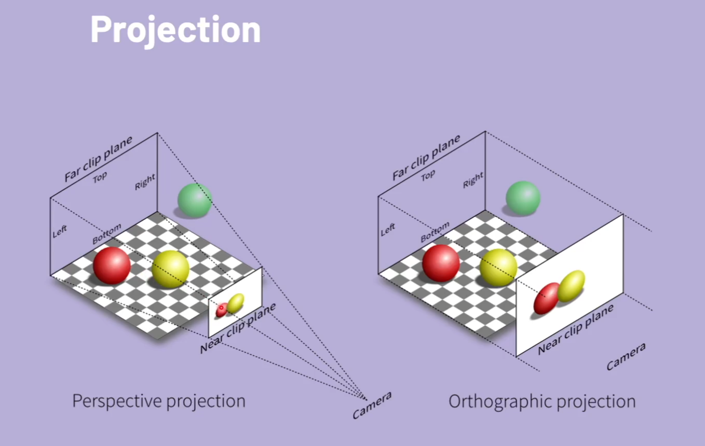
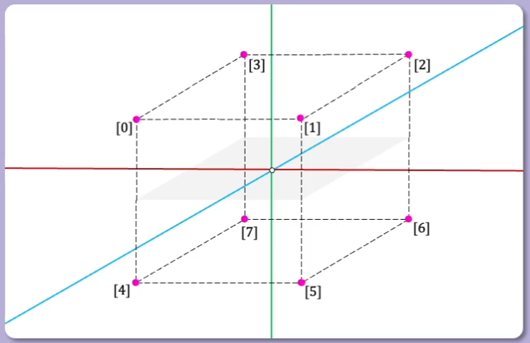
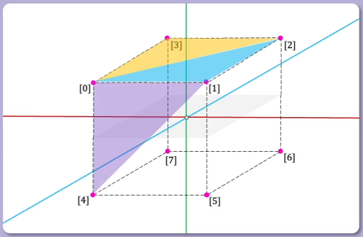

# 3d Graphics

- Vertex, are points in space, (x, y, z)
- Polygon face is defined by connecting vertices.
  - Quad faces are defined by 4 vertices
	- Triangle faces are defined by 3 vertices

## Projection

- Perspective projection, used for 3d graphics, field of view.
- Orthographic projection, used for 2d graphics, screen size.



### Perspective projection

**Perspective divide:**  Xscreen = Xworld / z    and    Yscreen = Yworld / z

The GTE does this quickly for us on the PS1.

### Vertices



A cube is a a 3d mesh.  It consists of vertices and faces.  The origin in the image becomes the pivot point, all the vertices are based off the origin of the mesh.  (0, 0, 0)

```c
SVECTOR vertices[] = {
	{ -128, -128, -128 },
	{  128, -128, -128 },
	{  128, -128,  128 },
	{ -128, -128,  128 },
	{ -128,  128, -128 },
	{  128,  128, -128 },
	{  128,  128,  128 },
	{ -128,  128,  128 }
};

short faces[] = {
	0, 3, 2,
	0, 2, 1,
	4, 0, 1,
	4, 1, 5,
	7, 4, 5,
	7, 5, 6,
	5, 1, 2,
	5, 2, 6,
	2, 3, 7,
	2, 7, 6,
	0, 4, 7,
	0, 7, 3
};
```

The faces are indices of how the vertices are connected to make a face or triangle.  Uses clockwise orientation to show that it is pointed towards the camera.  If we use counterclockwise, it would be pointing away from the camera.
Similarly clockwise orientation would point up, and counterclockwise would point down.  This is how 3d math works.




The SVECTOR is part of the LIBGTE library.

We have the following primitives:
- Matrix
- Vector
- SVector
- CVector
	- used for colors
- DVector
	- 2d for x and y