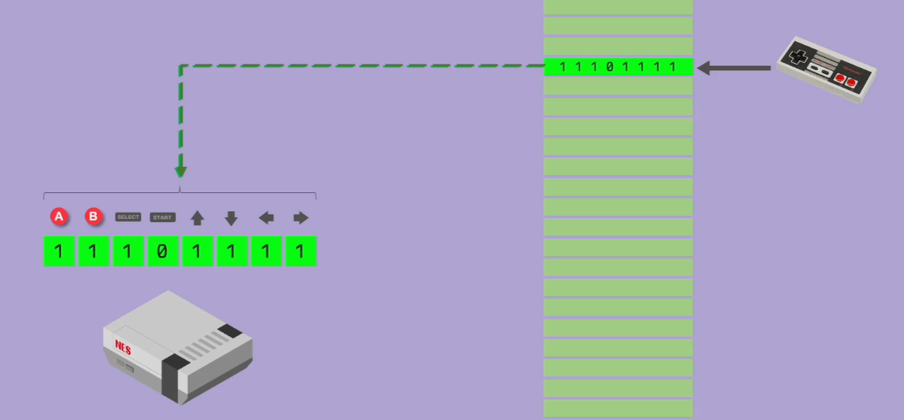
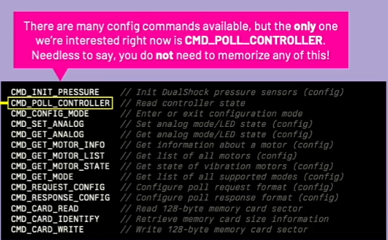

# Controller Input

Start with the digital pad which does not have the analog inputs.

## Inputs

Previously the inputs were saved to a memory address, and the console would get the state from the memory address.  Each button would map to a certain bit.



The PS1 controller and its memory card use a serial bus.  Both communicate using a simple packet-based protocol, listening for request packets sent by the console and replying with appropriate responses.

Each packet consists of an address, a command, and parameters.

The controller bus is shared with memory cards, an addressing mechanism is used to ensure packets are processed by a single device at a time.

The first byte of each request package is thus the "address" of the peripheral that shall respond to it.

```c
// Address byte
#define ADDR_CONTROLLER  0x01
#define ADDR_MEMORY_CARD 0x81
// Command byte
#define CMD_POLL_CONTROLLER  // Read controller state
```



```asm
PAD_L2     equ 0x0001 : Joypad Input: L2          (Bit 0)
PAD_R2     equ 0x0002 : Joypad Input: R2          (Bit 1)
PAD_L1     equ 0x0004 : Joypad Input: L1          (Bit 2)
PAD_R1     equ 0x0008 : Joypad Input: R1          (Bit 3)
PAD_T      equ 0x0010 : Joypad Input: Triangle    (Bit 4)
PAD_C      equ 0x0020 : Joypad Input: Circle      (Bit 5)
PAD_X      equ 0x0040 : Joypad Input: Cross       (Bit 6)
PAD_S      equ 0x0080 : Joypad Input: Square      (Bit 7)
PAD_SELECT equ 0x0100 : Joypad Input: Select      (Bit 8)
PAD_L3     equ 0x0200 : Joypad Input: L3          (Bit 9)  (Analog Mode Only)
PAD_R3     equ 0x0400 : Joypad Input: R3          (Bit 10) (Analog Mode Only)
PAD_START  equ 0x0800 : Joypad Input: Start       (Bit 11)
PAD_UP     equ 0x1000 : Joypad Input: Up          (Bit 12)
PAD_RIGHT  equ 0x2000 : Joypad Input: Right       (Bit 13)
PAD_DOWN   equ 0x4000 : Joypad Input: Down        (Bit 14)
PAD_LEFT   equ 0x8000 : Joypad Input: Left        (Bit 15)
```

To read the joypad input state, we can do everything manually, controlling individual interrupts, resetting the serial interface,
sending and receiving packets, send a singal to the interrupt controller whenever the DSR input is pulsed.

The playstation 1 also has helpers in the BIOS, BIOS Routines, which simplifies things (reads joypad state on VSYNC)

The Psy-Q has a library called `LIBETC.H` which provides the functions to read the joypad input.
