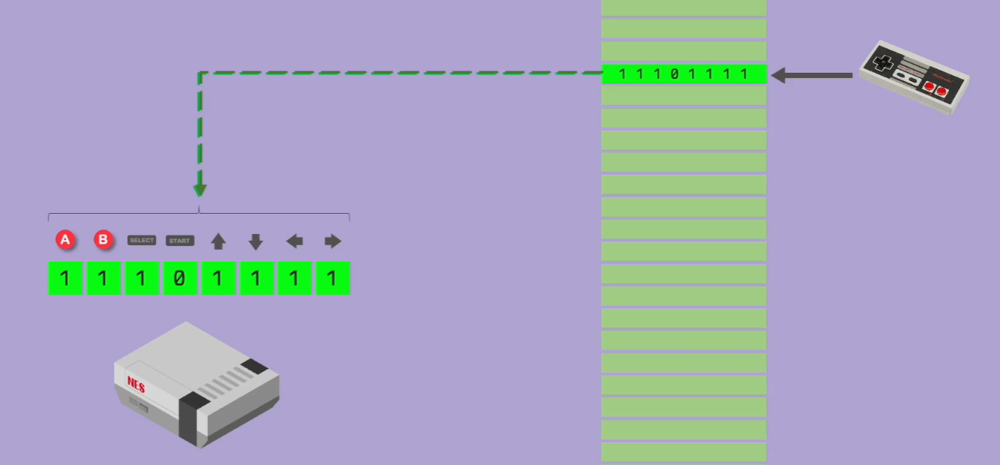
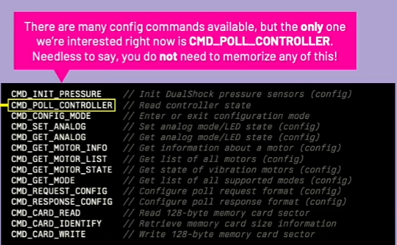
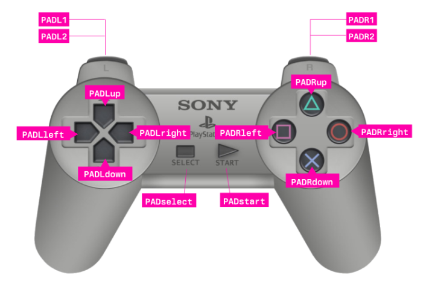

# Controller Input

Start with the digital pad which does not have the analog inputs.

## Inputs

Previously the inputs were saved to a memory address, and the console would get the state from the memory address.  Each button would map to a certain bit.



The PS1 controller and its memory card use a serial bus.  Both communicate using a simple packet-based protocol, listening for request packets sent by the console and replying with appropriate responses.

Each packet consists of an address, a command, and parameters.

The controller bus is shared with memory cards, an addressing mechanism is used to ensure packets are processed by a single device at a time.

The first byte of each request package is thus the "address" of the peripheral that shall respond to it.

```c
// Address byte
#define ADDR_CONTROLLER  0x01
#define ADDR_MEMORY_CARD 0x81
// Command byte
#define CMD_POLL_CONTROLLER  // Read controller state
```



```asm
PAD_L2     equ 0x0001 : Joypad Input: L2          (Bit 0)
PAD_R2     equ 0x0002 : Joypad Input: R2          (Bit 1)
PAD_L1     equ 0x0004 : Joypad Input: L1          (Bit 2)
PAD_R1     equ 0x0008 : Joypad Input: R1          (Bit 3)
PAD_T      equ 0x0010 : Joypad Input: Triangle    (Bit 4)
PAD_C      equ 0x0020 : Joypad Input: Circle      (Bit 5)
PAD_X      equ 0x0040 : Joypad Input: Cross       (Bit 6)
PAD_S      equ 0x0080 : Joypad Input: Square      (Bit 7)
PAD_SELECT equ 0x0100 : Joypad Input: Select      (Bit 8)
PAD_L3     equ 0x0200 : Joypad Input: L3          (Bit 9)  (Analog Mode Only)
PAD_R3     equ 0x0400 : Joypad Input: R3          (Bit 10) (Analog Mode Only)
PAD_START  equ 0x0800 : Joypad Input: Start       (Bit 11)
PAD_UP     equ 0x1000 : Joypad Input: Up          (Bit 12)
PAD_RIGHT  equ 0x2000 : Joypad Input: Right       (Bit 13)
PAD_DOWN   equ 0x4000 : Joypad Input: Down        (Bit 14)
PAD_LEFT   equ 0x8000 : Joypad Input: Left        (Bit 15)
```

To read the joypad input state, we can do everything manually, controlling individual interrupts, resetting the serial interface,
sending and receiving packets, send a singal to the interrupt controller whenever the DSR input is pulsed.

The playstation 1 also has helpers in the BIOS, BIOS Routines, which simplifies things (reads joypad state on VSYNC)

The Psy-Q has a library called `LIBETC.H` which provides the functions to read the joypad input.

### LIBETC.H

The function `extern int PadIdentifiers` is used to read the joypad input state.  I've left LIBETC.H functions in the code because this is what we will end up using in our game code.



### BIOS Routines

We can use a BIOS subroutine to read the joypad input state for us.  So we will continue using the assembly that we used above and add some buffers which we can read from.

```asm
; ----------------------------------------------
; GPU Registers
; ----------------------------------------------
CP0 equ 0x1810
CP1 equ 0x1814

; ----------------------------------------------
; Joypad Constants
; ----------------------------------------------
PAD_L2     equ 0x0001 : Joypad Input: L2          (Bit 0)
PAD_R2     equ 0x0002 : Joypad Input: R2          (Bit 1)
PAD_L1     equ 0x0004 : Joypad Input: L1          (Bit 2)
PAD_R1     equ 0x0008 : Joypad Input: R1          (Bit 3)
PAD_T      equ 0x0010 : Joypad Input: Triangle    (Bit 4)
PAD_C      equ 0x0020 : Joypad Input: Circle      (Bit 5)
PAD_X      equ 0x0040 : Joypad Input: Cross       (Bit 6)
PAD_S      equ 0x0080 : Joypad Input: Square      (Bit 7)
PAD_SELECT equ 0x0100 : Joypad Input: Select      (Bit 8)
PAD_L3     equ 0x0200 : Joypad Input: L3          (Bit 9)  (Analog Mode Only)
PAD_R3     equ 0x0400 : Joypad Input: R3          (Bit 10) (Analog Mode Only)
PAD_START  equ 0x0800 : Joypad Input: Start       (Bit 11)
PAD_UP     equ 0x1000 : Joypad Input: Up          (Bit 12)
PAD_RIGHT  equ 0x2000 : Joypad Input: Right       (Bit 13)
PAD_DOWN   equ 0x4000 : Joypad Input: Down        (Bit 14)
PAD_LEFT   equ 0x8000 : Joypad Input: Left        (Bit 15)

; ----------------------------------------------
; NEW INFO
; Joypad Buffer & Data
; ----------------------------------------------
PadBuffer: .word 0          ; Pad Buffer (automatically stored every frame)
PadData:   .word 0          ; Pad Data (read from the BIOS Routine VSYNC routine)

; XPos: .word 0               ; Variable to hold the position top-left X of the rectangle
; YPos: .word 0               ; Variable to hold the position top-left Y of the rectangle

Main:
	;;;;;;;;;;;;;;;;;;;;;;;;;;;;;;;;;;;;;;;;;;
	; Initialize pad using BIOS routine
	;;;;;;;;;;;;;;;;;;;;;;;;;;;;;;;;;;;;;;;;;;
	li $t1, 0x15
	li $a0, 0x20000001
	li $t2, 0xB0
	la $a1, PadBuffer       ; Set Pad Buffer address to automatically update each frame
	jalr $t2                ; Jump to BIOS Routine
	nop

	; ------------------------------------------------------------------------
	; Set $a0 as the global parameter with the IO_BASE_ADDR to be used by subs
	; ------------------------------------------------------------------------
	lui $a0, IO_BASE_ADDR           ; Global Param: I/O Port Base Address (0x1F80****)

	; ------------------------------------------------------------------------
	; Send commands to the GP1 (mapped at 0x1f801814)
	; The GP1 is for display control and environment setup
	; (Command = 8-Bit MSB, Parameter = 24-Bit LSB)
	; CCPPPPPP: CC=Command, PPPPPP=Parameter
	; ------------------------------------------------------------------------
	li $t1, 0x00000000       ; 00 = Reset GPU
	sw $t1, GP1($a0)         ; Write to GP1

	li $t1, 0x03000000       ; 00 = Display enable
	sw $t1, GP1($a0)         ; Write to GP1

	li $t1, 0x08000000       ; 00 = Display mode (320x240, 15-bit, NTSC)
	sw $t1, GP1($a0)         ; Write to GP1

	li $ti, 0x06C60260       ; 06 = Horz Display Range - 0bxxxxxxxxxxXXXXXXXXXX (3168..608)
	sw $t1, GP1($a0)         ; Write to GP1

	li $ti, 0x07042018       ; 07 = Vert Display Range - 0byyyyyyyyyYYYYYYYYYY (264..24)
	sw $t1, GP1($a0)         ; Write to GP1

	; ------------------------------------------------------------------------
	; Send commands to GP0 (mapped at 0x1f801810)
	; These GP0 commands are used to setup the drawing area
	; (Command = 8-Bit MSB, Parameter = 24-Bit LSB)
	; CCPPPPPP CC=Command PPPPPP=Parameter
	; ------------------------------------------------------------------------
	li $t1, 0xE1000400       ; 0E = Draw mode settings
	sw $t1, GP0($a0)         ; Write to GP0

	li $t1, 0xE3000000       ; E3 = Drawing Area TopLeft - 0bYYYYYYYYYYXXXXXXXXXX (10 bits for Y and X)
	sw $t1, GP0($a0)         ; Write to GP0

	li $t1, 0xE403BD3F       ; E4 = Drawing area BottomRight - 0bYYYYYYYYYYXXXXXXXXXX (10 bits for X=319 and y=239)
	sw $t1, GP0($a0)         ; Write to GP0

	li $t1, 0xE5000000       ; E5 = Clear Drawing Area
	sw $t1, GP0($a0)         ; Write to GP0

Refresh:

;;;;;;;;;;;;;;;;;;;;;;;;;;;;;;;;;;;;;;;;;;;;;;;;;;;;;;;;;;;;;;;;;;;;
;; Wait VSYNC & Store XOR Pad Data
;;;;;;;;;;;;;;;;;;;;;;;;;;;;;;;;;;;;;;;;;;;;;;;;;;;;;;;;;;;;;;;;;;;;
WaitVSync:
	li $a1, PadBuffer        ; Load Pad Buffer Address
Wait:
	lw $t0, 0($a1)           ; Load Pad Buffer
	nop						           ; Delay
	beqz $t0, Wait           ; If (Bad Buffer == 0) Wait NOTE: The moment we get something different from 0, it means we got data or a vsync, this is why we wait until this value is not equal to 0

;;;;;;;;;;;;;;;;;;;;;;;;;;;;;;;;;;;;;;;;;;;;;;;;;;;;;;;;;;;;;;;;;;;;;
;; Check if Joypad buttons are pressed
;;;;;;;;;;;;;;;;;;;;;;;;;;;;;;;;;;;;;;;;;;;;;;;;;;;;;;;;;;;;;;;;;;;;;
PressUp:
	la $a1, PadData         ; Load Input Data Address
	lw $t0, 0($a1)          ; Load Input Data
	nop
	andi $t0, PAD_UP        ; Check if Bit 0 is 1
	beqz $t0, PressDown     ; If $t0 is = 0, means the button is still up, so we jump to PressDown to check for button press
	nop
	; Logic for when the button is pressed down
	la $t2, YPos
	lw $t3, 0($t2)
	nop
	addiu $t3, $t3, 01      ; YPos--       ; If Y is pressed, we decrease it by 1 or move it down, so game logic is Y-- if pressed
	sw $t3, 0($t2)

PressDown:
	la $a1, PadData         ; Load Input Data Address
	lw $t0, 0($a1)          ; Load Input Data
	nop
	andi $t0, PAD_DOWN      ; $t0 = Input Status
	beqz $t0, PressRight    ; If button-down is not pressed, bypass and dest button right
	nop
	; here goes logic for when button up is down:
	la $t2, YPos
	lw $t3, 0($t2)
	nop
	addiu $t3, $t3, -01     ; YPos++      ; Same as before, if Y is pressed, we increase it by 1 or move it up, so game logic is Y++ if pressed
	sw $t3, 0($t2)

PressRight:
	la $a1, PadData         ; Load Input Data Address
	lw $t0, 0($a1)          ; Load Input Data Word
	nop
	andi $t0, PAD_RIGHT     ; $t0 = Input Status
	beqz $t0, PressLeft     ; If button-right is not pressed, jump to PressLeft to test for left button press
	nop
	; Here is the logic for when the button is pressed right:
	la $t2, XPos
	lw $t3, 0($t2)
	nop
	addiu $t3, $t3, 1       ; XPos++ which increments the x position by 1
	sw $t3, 0($t2)

PressLeft:
	la $a1, PadData         ; Load Input Data Address
	lw $t0, 0($a1)          ; Load Input Data
	nop
	andi $t0, PAD_LEFT      ; $t0 = Input Status
	beqz $t0, EndInputCheck ; If button-left is not pressed, jump to end input check
	nop
	; Here is the logic for when the button is pressed left:
	la $t2, XPos
	lw $t3, 0($t2)
	nop
	addiu $t3, $t3, -1      ; XPos-- which decrements the x position by 1
	sw $t3, 0($t2)

EndInputCheck:

; --------------------------------------------------------------------------------
; Clear the screen (draw a rectangle on VRAM).
; --------------------------------------------------------------------------------
ClearScreen:
	li $t1, 0x02422E1B                  ; 02 = Fill rectangle in VRAM (Param Color: 0xBBGGRR)
	sw $t1, GP0($a0)                    ; Write to GP0
	li $t1, 0x00000000                  ; Fill Area, Parameter: 0xYYYYXXXX - Topleft (0,0)
	sw $t1, GP0($a0)                    ; Write to GP0
	li $t1, 0x00EF013F                  ; Fill Area, Parameter: 0xHHHHWWWW - (Height=239, Width=319)
	sw $t1, GP0($a0)                    ; Write to GP0

; --------------------------------------------------------------------------------
; Draw a small rectangle at position XPos, YPos
; --------------------------------------------------------------------------------
DrawRectangle:
	li $t1, 0x00200FF00                 ; 02 = Fill rectangle in VRAM (Param Color: 0xBBGGRR)
	sw $t1, GP0($a0)                    ; Write to GP0
	la $t2, YPos
	lw $t3, 0($t2)
	nop
	sll $t3, $t3, 16                    ; YPos <<= 16
	la $t2, XPos
	lw $t2, 0($t2)
	nop
	andi $t4, $t4, 0xFFFF               ; XPos &= 0xFFFF
	or $t5, $t3, $t4                    ; YPos | XPos
	sw $t5, GP0($a0)                    ; Write to GP0 (YYYYXXXX)

	li $t1, 0x00200020                  ; Fill Area, Parameter: 0xYYYYXXXX - Height=32, Width=32
	sw $t1, GP0($a0)                    ; Write to GP0

	j Refresh
	nop
```

.close
