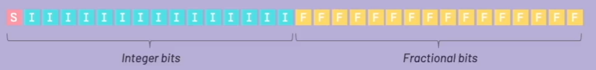
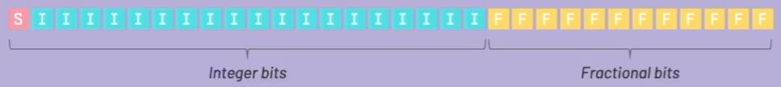

# Playstation 1 Math

I wanted to have some notes when it comes to doing math on the playstation 1.  The PS1 has some unique limitations due to the age of the hardward.

Due to the 32 bit processor, the registers are only 32 bits , which means we have 32 bits to represent the all the possible numbers in our game.\
This give us a limit of 4,294,976,296 or __2<sup>32</sup>__ so we have to represent our real numbers like integers and decimals within this range.

<----------------------|---------------------->\
&nbsp;
-7 -6 -5 -4 -3 -2 -1
&nbsp;
0 &nbsp;
1 &nbsp;
2 &nbsp;
3 &nbsp;
4 &nbsp;
5 &nbsp;
6 &nbsp;
7 &nbsp; ...\
<-- Negative Nums -- Origin -- Positive Nums -->\

## Number notation

The way we handle numbers on the playstation 1 is to use something similiar to the scientific notation you find on a calculator.

(-1)<sup>s</sup> * 1.M * 2<sup>(E-127)</sup>

[s]|[e][e][e][e][e][e][e][e]|[m][m][m][m][m][m][m][m][m][m][m][m][m][m][m][m][m][m][m][m][m][m][m]\
&nbsp;
| &nbsp;&nbsp; ____________________ &nbsp;&nbsp;&nbsp;&nbsp;&nbsp; ___________________________________________________________________\
sign
&nbsp;&nbsp;&nbsp;&nbsp;&nbsp; Exponent
&nbsp;&nbsp;&nbsp;&nbsp;&nbsp;&nbsp;&nbsp;&nbsp;&nbsp;&nbsp;
&nbsp;&nbsp;&nbsp;&nbsp;&nbsp;&nbsp;&nbsp;&nbsp;&nbsp;&nbsp;
&nbsp;&nbsp;&nbsp;&nbsp;&nbsp;&nbsp;&nbsp;&nbsp;&nbsp;&nbsp;
&nbsp;&nbsp;&nbsp;&nbsp;&nbsp;&nbsp;&nbsp;&nbsp;&nbsp;&nbsp;
&nbsp;&nbsp;&nbsp;&nbsp;&nbsp;Mantissa

This is the IEEE754 standard for handling numbers.

## Floating point resolution

Floating points have different resolutions, which is just the shortest distance between two values that can be represented exactly.

For example:

[0]`.`[0] [0] [7]  This has a resolution of 0.001

[4] [6]`.`[2] [3]  Resolution is 0.01

[7] [7] [5]`.`[8]  Resolution is 0.1

[3] [0] [7] [1]`.`  Integer resolution

The gap/distance between values is called `ULP` (`U`nit of `L`east `P`recision) and it is not a constant number, as it depends on the value itself.

**NOTE** because we are using 32bits to represent the numbers and the fact that we are using the mantissa notation, it means that we lose exactness.

### Fixed Point Representation

This is basically using integers to represent fractional number systems.  We do this by reserving a fixed number of bits for the integer and another set of bits for the fractional part.
This means that we have a fixed ULP.

*16.16* fixed point.



*20.12* fixed point, most commonly used on PS1 games because the registers of the GTE use this format internally.



The resolution for `20.12` is 1 / 2<sup>12</sup>  which is 1/4096 = 0.0009765625\
This means we will have this in our code:

```c
#define ONE 4096 /* GTE regards 4096 as 1.0 */

// This is why we set ONE = 4096 in the code above
fix_num += 4096;   // += 1.0
fix_num -= 4096;   // -= 1.0
fix_num += 2048;   // += 0.5
fix_num -= 6144;   // -= 1.5
```

What this means is that if we do a printf we might see some really high number for example:\
position.vx = 9912.9\
However, what we need to divide by 4096 in order to get the real value.

Something like this works in code:  position.vx >> 12 = 242

*NOTE:* Some people call this the scale of the fix point representation.

```c
#define ONE 4096

// Fractional addition and subtraction works as expected
long a = 20 * ONE;     // ToFixed(20)
long b = 17 * ONE;     // ToFixed(17)
long c = a + b;        // Addition and subtraction just works

// Fractional multiplication is different
mul = 2048;                        // This is our multiplier, or 0.5
fix_num = (fix_num * mul) >> 12;   //  Shift right by 12

mul = 6144;                        // This is our multiplier, or 1.5
fix_num = (fix_num * mul) >> 12;   //  Shift right by 12

// Fractional division
div = 2048;                        // This is our divisor, or 0.5
fix_num = (fix_num * ONE) / div >> 12;   //  Shift right by 12

div = 6144;                              // This is our divisor, or 1.5
fix_num = (fix_num * ONE) / div >> 12;   //  fix_num /= div
```

We shift out of the 12 bytes because they are part of the fractional part, which is the underflow.  So we get rid of the underflow, which leaves us with the 32 bit number that we need for the PS1.
We are going to try and multiply by the binary numbers like 2 or 4 so that we can leverage bit shifting instead of CPU intensive operations.

Example:\
position->vx >>= 1;  // Shift right by 1 which is equivalent to multiply by 2
position->vy >>= 1;
position->vz >>= 1;

## Appendix

The PS1 Games we are creating with use the 20.12 fixed point format.