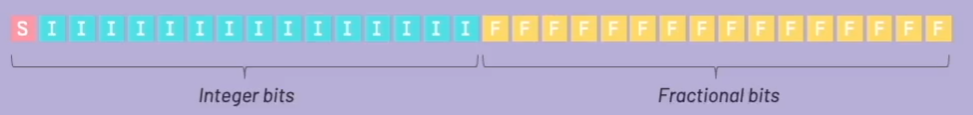
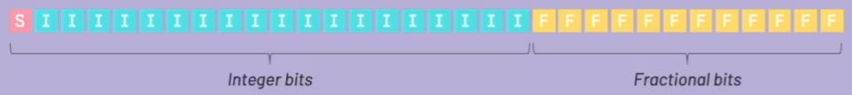

# Playstation 1 Math

I wanted to have some notes when it comes to doing math on the playstation 1.  The PS1 has some unique limitations due to the age of the hardward.

Due to the 32 bit processor, the registers are only 32 bits , which means we have 32 bits to represent the all the possible numbers in our game.\
This give us a limit of 4,294,976,296 or `2^32^` so we have to represent our real numbers like integers and decimals within this range.

<----------------------|---------------------->\
 -7 -6 -5 -4 -3 -2 -1  0  1  2  3  4  5  6  7 ...\
<-- Negative Nums -- Origin -- Positive Nums -->\

## Number notation

The way we handle numbers on the playstation 1 is to use something similiar to the scientific notation you find on a calculator.

(-1)^s^ * 1.M * 2^(E-127)^

[s]|[e][e][e][e][e][e][e][e]|[m][m][m][m][m][m][m][m][m][m][m][m][m][m][m][m][m][m][m][m][m][m][m]\
 |   ______________________   ___________________________________________________________________\
sign      Exponent                                             Mantissa\

This is the IEEE754 standard for handling numbers.

## Floating point resolution

Floating points have different resolutions, which is just the shortest distance between two values that can be represented exactly.

For example:

[0]`.`[0] [0] [7]  This has a resolution of 0.001

[4] [6]`.`[2] [3]  Resolution is 0.01

[7] [7] [5]`.`[8]  Resolution is 0.1

[3] [0] [7] [1]`.`  Integer resolution

The gap/distance between values is called `ULP` (`U`nit of `L`east `P`recision) and it is not a constant number, as it depends on the value itself.

**NOTE** because we are using 32bits to represent the numbers and the fact that we are using the mantissa notation, it means that we lose exactness.

### Fixed Point Representation

This is basically using integers to represent fractional number systems.  We do this by reserving a fixed number of bits for the integer and another set of bits for the fractional part.

*16.16* fixed point.

*20.12* fixed point, most commonly used on PS1 games because the registers of the GTE use this format internally.

